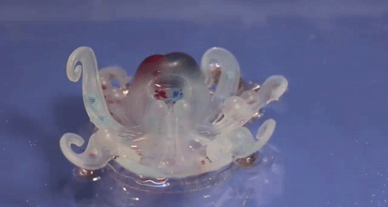

# Open challenges in *Soft Robotics*

## Open challenges in Soft Robotics
 Soft robotics is a new field of robotics purposefully designed with **soft elements** whose goal is to endow the system with \textbf{natural motion}\footnote[1]{Or, depending on the background, biological morphology}.

 This leads to a number of advantages:

 - Flexibility,
 - Hyper-redundancy,
 - Passive w.r.t. its environment,
 - (Extreme) durability;


## Open challenges in Soft Robotics
 ... but also \alert{disadvantages}

## Some examples

<!-- \movie{\includegraphics[width=5cm]{./img/gif/frame-0.png}}
{./img/octo.mp4} -->

<!-- \movie{\includegraphics[width=5cm]{./img/gif/frame-0.png}}{} -->

<!-- \animategraphics[width=\textwidth,controls,palindrome]{36}{./img/gif/frame-}{0}{67} -->

<!-- { height=120px } -->

## Bouncing ball

Implementation in SOROTOKI \newline

\scriptsize
```matlab
sdf = sCircle(1) - sCircle(0.75);    % sdf object
flr = sLine(-3,-3,-5,50);            % sdf floor

msh = Mesh(sdf,'NElem',500);         % generates mesh
fem = Fem(msh,'TimeStep',1/60);      % generates fem  

fem.Material = Ecoflex0030();        % assign material

g = @(x) flr.eval(x);                % constraint
fem.addConstraint('Contact',g);      % add contact

fem.simulate();                      % solve dynamics
```

## Design synthesis of PneuNet

\scriptsize
```matlab
msh = Mesh(sdf,'NElem',3e3);  

fem = Fem(msh,'TimeStep',1/60,...
              'VolumeInfill',0.25,...
              'Objective','Compliant',...
              'Repeat',ones(9,1),...
              'Material', Ecoflex0030);     

[L, R]  = fem.FindNodes('Left','Right'); 
C  = fem.FindElements('Center',[],1);

fem = fem.addSupport(L,[1,1]);
fem = fem.addOutput(R,[0,-1]);
fem = fem.addMyocyte(C,10*kpa);              

fem.optimize(); 
```

## Design synthesis of PneuNet

\scriptsize
```matlab
msh = Mesh(sdf,'NElem',3e3);          
  :
  :
fem.optimize(); 
```

```matlab
mshr = fem.exportMesh(ISO,tol,[1,MinH,MaxH]);          
  :
  :
femr.solve(); 
```


## Closed-loop control

Consider the (Ph)-system:
$$\dot{x} = (\mathcal{J} - \mathcal{D}) \nabla_{\!x}\,H(x) + G(x) u$$

where $H(x(q,p)):= \frac{1}{2}p^\top M^{-1} p + \mathcal{U}(q)$.

##
